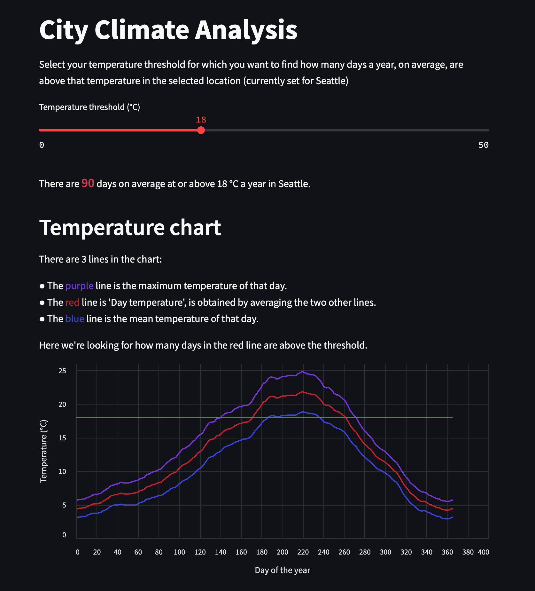

# City Climate Analysis

I created this just to test Streamlit's integration with Snowflake.
I wanted to figure out how many days a year I could go out just with a t-shirt, and for me that's about 18°C (64°F).

The app is published here: https://city-climate-analysis.streamlit.app/

Here's what the app looks like:

